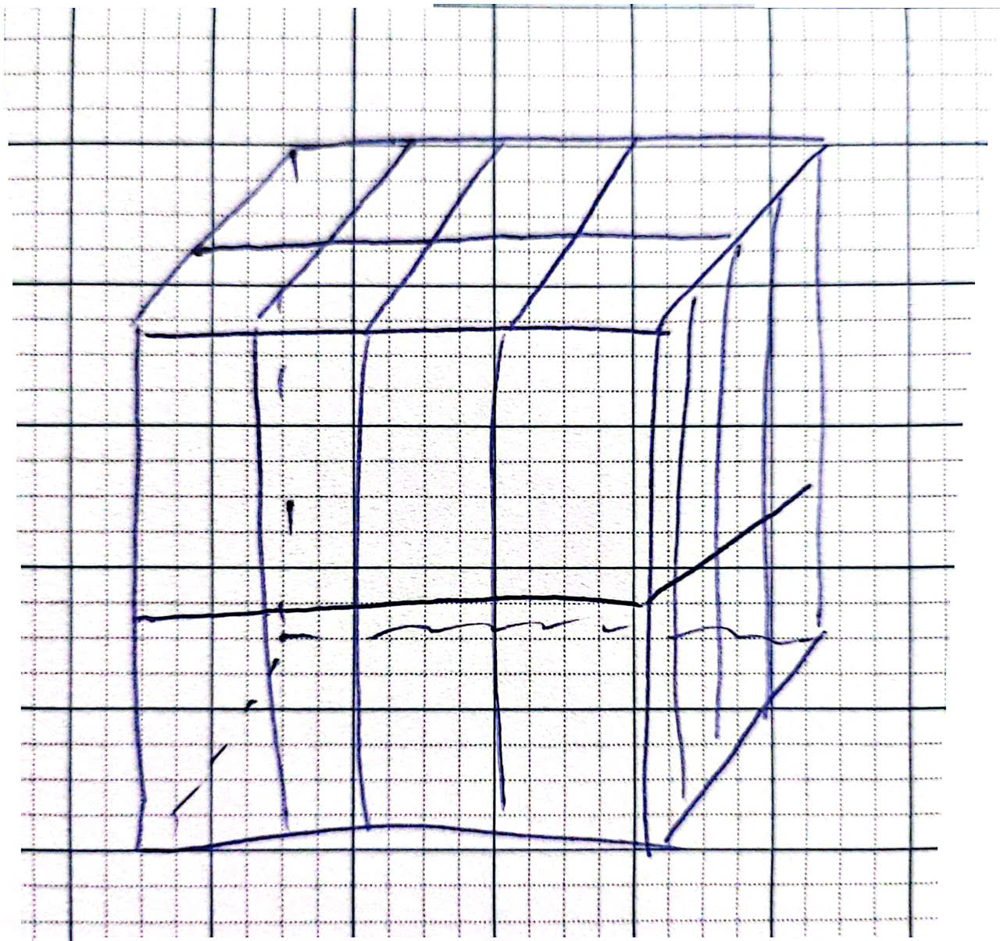

# ELE-D24-NguyenThiKieuTrang - Báo cáo công việc 02/05/2026

# A. Công việc đã làm

1. Mảng 1 chiều, mảng 2 chiều

2. FIFO

3. Quản lí bộ nhớ (Memory)

4. Triển khai thuật toán Fixed Point 32 bit

# B. Báo cáo chi tiết

## 1. Mảng 1 chiều, mảng 2 chiều

### 1.1. Mảng 1 chiều

#### 1.1.1. Tìm hiểu về mảng 1 chiều

- Khái niệm: Mảng 1 chiều trong Verilog là một tập hợp các phần tử có cùng kiểu dữ liệu (thường là reg hoặc wire), được truy cập thông qua một chỉ số (index) duy nhất

- Cú pháp: <kiểu_dữ_liệu> <tên_mảng> [<chỉ_số_đầu>:<chỉ_số_cuối>];

- VD: reg [7:0] my_array [0:15];

  + Khai báo một mảng tên my_array có 16 phần từ (từ 0->15)
  
  + Mỗi phần tử là một vecto 8-bit : mem[0]=8'b01010101
  
  + my_array [2] = 8'b10101010: gán giá trị 8'b10101010 vào vecto thứ 3 của mảng
  
  + my_array[14][2] = 1'b1: gán giá trị 1'b1 vào bit 2 trong vecto thứ 15 của mảng
  
- Đặc điểm:

  + Làm bộ nhớ (RAM nhỏ)
  
  + Lưu bảng tra cứu (lookup table)
  
  + Lưu dữ liệu tạm trong thiết kế số
  
#### 1.1.2. Ví dụ

- Gán và đọc cơ bản:

```
module arra(
	output reg [7:0] out);

reg [7:0] mem [3:0];
	
initial begin 
	mem[0]=8'b10101010;
	mem[1]=8'b11110000;
	mem[2]=8'b00001111;
	mem[3]=8'b01010101;
	
	out=mem[2];
end
endmodule
```

```
module arra_tb();
	wire [7:0] out;

arra dut(
	.out(out));

initial begin
	#5;
	$display("mem[0] = %b", dut.mem[0]);
	$display("mem[1] = %b", dut.mem[1]);
	$display("mem[2] = %b", dut.mem[2]);
	$display("mem[3] = %b", dut.mem[3]);
	$display("out = %b", dut.out);
	$finish;
end
endmodule 
```

- Sử dụng vòng lặp

```
module arra_loop(
	output reg [7:0] out);

reg [7:0] mem[7:0];
integer i;

initial begin
	for(i=0;i<8;i=i+1) begin
		mem[i]=i*2;
	end
	
	out=mem[3];
end
endmodule  
```
```
module arra_loop_tb();
	wire [7:0] out;

arra_loop dut(
	.out(out));
	
integer i;
initial begin
	#5;
	for(i=0;i<8;i=i+1)
		$display("mem[%0d]=%0d",i,dut.mem[i]);
	$display("\nGia tri out=%0d",out);
	$finish;
end
endmodule 
```

-RAM 16X8

```
module arra_ram(
	input wire clk,
	input wire en,
	input wire [3:0] addr,
	input wire [7:0] data_in,
	output reg [7:0] data_out);
	
reg [7:0] mem [15:0];

always @(posedge clk) begin
	if(en)
		mem[addr] <= data_in;
	else
		data_out<=mem[addr];
end
endmodule 	
```

```
module arra_ram_tb();
	reg clk;
	reg en;
	reg [3:0] addr;
	reg [7:0] data_in;
	wire [7:0] data_out;
	
arra_ram dut(
	.clk(clk),
	.en(en),
   .addr(addr),
	.data_in(data_in),
	.data_out(data_out));
	
always #5 clk=~clk;
integer i;

initial begin
	clk=0;
	en=0;
	addr=0;
	data_in=0;
	
	$display("GHI DU LIEU");
	for(i=0;i<16;i=i+1) begin
		@(posedge clk);
		en=1;
		addr=i;
		data_in=i*3;
		$display("addr=%0d, data_in=%0d", addr, data_in);
	end
	
	$display("DOC DU LIEU");
	for(i=0;i<16;i=i+1) begin
		@(posedge clk);
		en=0;
		addr=i;
		@(posedge clk);
		$display("addr=%0d, data_out=%0d", addr, data_out);
	end
	
	$finish;
end
endmodule	
```

### 1.2. Mảng 2 chiều 

#### 1.2.1. Tìm hiểu về mảng 2 chiều

- Cú pháp: type <signed> <range> array_name [index_1:index2] [index_3:index_4]

- VD: reg [7:0] abiter [1:0] [3:0]

	+ mảng abiter 2 chiều có kích thước 2x4 với mỗi phần tử trong thanh ghi có độ rộng 8 bit  (tổng số bit trong mảng là 2x4x8=64bit)
	
	+ hình ảnh mô tả: 
	
	+ abiter [0][3]: truy xuất vào vecto ở hàng 0 cột 3 của mảng abiter
	
	+ abiter [0][3][2]: truy xuất vào bit thứ 2 của vecto ở hàng 0 cột 3 của mảng abiter

## 2. FIFO

### 2.1. Tìm hiểu về FIFO

- Khái niệm: FIFO (Fist in fist out), chỉ thứ tự đọc và ghi dữ liệu vào ra của FIFO, dữ liệu nào được ghi vào trước thì sẽ được đọc ra trước, dữ liệu được ghi (write) vào cuối hàng đợi và đọc (read) ra từ đầu hàng đợi.

- FIFO được sử dụng khi:

	+ Cần lưu 1 lượng dữ liệu tương đối lớn hơn so với các thanh ghi đơn lẻ. Lượng dữ liệu này thường có kích thước không quá lớn.

    + Cần lưu tạm một lượng dữ liệu phục vụ cho quá trình đồng bộ giữa 2 miền clock có xung nhịp khác nhau.

    + Cần lưu lại một lượng dữ liệu là đơn vị của quá trình tính toán nào đó.
	
- Về logic thì FIFO không khác gì mảng có N phần tử, mỗi phần tử có độ rộng là M: reg [M-1:0] FIFO [N-1:0]

- Việc xác định phần tử để truy cập vào FIFO được thực hiện thông qua các con trỏ ( pointers ) hoặc địa chỉ ( address ).

    + Phần ghi FIFO sử dụng address ghi

    + Phần đọc FIFO sử dụng address đọc

- Do FIFO là mảng FlipFlop cho nên nó có thể lưu lại giá trị. Giả sử FIFO đã được ghi đầy, về lý thuyết thì chúng ta có thể truy cập bất kỳ phần tử nào của FIFO thông qua address đọc.

- Khi không được ghi, thì dữ liệu trong FIFO sẽ không thay đổi. Do đó, chỉ có việc ghi vào mới làm giá trị của FIFO thay đổi. Việc ghi vào sẽ vì thế mà được điều khiển ( control ) bằng tín hiệu "write_enable".

- FIFO cũng như các loại memory nói chung, không dùng tín hiệu reset. Muốn thiết lập giá trị ban đầu cho FIFO thì cần phải thực hiện việc ghi vào FIFO các giá trị khởi tạo.

### 2.2.Ví dụ

```
module fifo(
    input clk,
    input rst,
    input wr,
    input rd,
    input [7:0] din,
    output reg [7:0] dout,
    output full,
    output empty
);

reg [7:0] mem [0:7];
reg [2:0] wptr, rptr;
reg [3:0] count;

assign full  = (count == 8);
assign empty = (count == 0);

always @(posedge clk or posedge rst)
begin
    if(rst)
    begin
        wptr <= 0;
        rptr <= 0;
        count <= 0;
    end
    else
    begin
        if(wr && !full)
        begin
            mem[wptr] <= din;
            wptr <= wptr + 1;
            count <= count + 1;
        end

        if(rd && !empty)
        begin
            dout <= mem[rptr];
            rptr <= rptr + 1;
            count <= count - 1;
        end
    end
end

endmodule
```

```
module FIFO_tb;
    reg clk;
    reg rst;
    reg wr;
    reg rd;
    reg [7:0] din;

    wire [7:0] dout;
    wire full;
    wire empty;

    fifo uut(
        .clk(clk),
        .rst(rst),
        .wr(wr),
        .rd(rd),
        .din(din),
        .dout(dout),
        .full(full),
        .empty(empty));

	always #5 clk=~clk;

   initial begin
        rst = 1;
        wr = 0;
        rd = 0;
        din = 0;

        #20;
        rst = 0;
		  
        @(posedge clk); wr = 1; din = 8'd15; //ghi
        @(posedge clk); wr = 0;
		  
        @(posedge clk); wr = 1; din = 8'd26;
        @(posedge clk); wr = 0;
		  
        @(posedge clk); wr = 1; din = 8'd39;
        @(posedge clk); wr = 0;

        repeat(3) begin // doc ca 3 phan tu
            @(posedge clk); rd = 1;

            @(posedge clk); rd = 0;
        end

        repeat(8) begin // ghi day thanh ghi FIFO
            @(posedge clk); wr = 1; din = din + 8'd1;
            @(posedge clk); wr = 0;
        end

   
        @(posedge clk); wr = 1; din = 8'd100; // thu ghi khi full thanh ghi FIFO
        @(posedge clk); wr = 0;

        repeat(8) begin // thu doc khi full
            @(posedge clk); rd = 1;
            @(posedge clk); rd = 0;
        end

        @(posedge clk); rd = 1; //thu doc khi emty
        @(posedge clk); rd = 0;

        #20;
        $finish;

    end

endmodule
```

## 3. Quản lí bộ nhớ

## 4. Triển khai thuật toán fixed point 32 bit

### 4.1. Cộng/trừ 2 số nhị phân 32 bit

- Code
```
module add_fp(a,b,y);
	input [31:0] a,b;
	output reg [31:0] y;
	
	always @(*) begin
		//TH1: CUNG DAU
		if(a[31]<=b[31]) begin 
			y[30:0]<=a[30:0]+b[30:0];
			y[31]<=a[31];
		end
		//TH2: KHAC DAU
		else begin
			if(a[31]>b[31]) begin 
				y[30:0]<=a[30:0]-b[30:0];
				y[31]<=a[31];
			end
			if(a[31]<b[31]) begin
				y[30:0]<=b[30:0]-a[30:0];
				y[31]<=b[31];
			end
		end
	end
endmodule
```

### 4.2. Nhân 2 số nhị phân 32 bit

- Code
```
module mult_fp(a,b,y);
	input [31:0] a,b;
	output [31:0] y;

	wire [63:0] result;
	wire [31:0] temp;
	
	assign temp[31] = a[31] ^ b[31];
	assign result = a[30:0] * b[30:0];
	assign temp[30:0] = result[49:19];
	assign y = {temp[31],temp[30:0]};
endmodule 
```

### 4.3. Testbench

module FP_tb;
    reg  [31:0] a;
    reg  [31:0] b;

    wire [31:0] y_add;
    wire [31:0] y_mult;

    add_fp ADD(
        .a(a),
        .b(b),
        .y(y_add));

//    mult_fp MULT(
//        .a(a),
//        .b(b),
//        .y(y_mult));

    initial begin

        a = 32'h404CCCCD;      // 3.2
        b = 32'h40933333;      // 4.6
        #20;

        a = 32'hC04CCCCD;      // -3.2
        b = 32'h40933333;      // 4.6
        #20;
		  
        a = 32'h404CCCCD;		// 3.2 
        b = 32'hC0933333;		//-4.6
        #20;

        a = 32'hC04CCCCD;		//-3.2
        b = 32'hC0933333;		//-4.6
        #20;

        a = 32'h40500000;      // 3.25
        b = 32'h40933333;      // 4.6
        #20;

        a = 32'hC0500000;		//-3.25
        b = 32'h40933333;		///4.6
        #20;

        $finish;

    end
	 
endmodule

