# Bộ lọc FIR

## 1. Bộ lọc

### 1.1. Bộ lọc FIR là gì?

- Bộ lọc FIR là bộ lọc số có đáp ứng xung hữu hạn, với các đặc điểm như tần số cắt, băng chuyển tiếp và độ suy giảm,dùng để lọc nhiễu (dựa vào việc lọc bỏ các tần số không mong muốn) có dạng

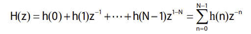

=> đáp ứng xung h(n) là: 

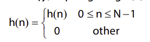

=> Phương trình sai phân tuyến tính

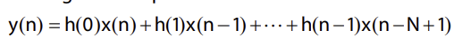

=> Cấu trúc bộ lọc

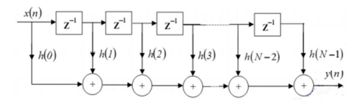

### 1.2. Các loại cửa số

- Vì thực tế, chuỗi đáp ứng xung có thể là chuỗi vô hạn, nên để có được bộ lọc FIR, chúng ta cần nhân đáp ứng xung lý thuyết với một cửa sổ để tạo số bậc hữu hạn (hạn chế độ dài chuỗi đáp ứng xung)

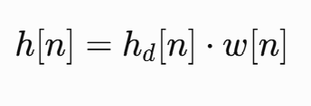

- Công thức

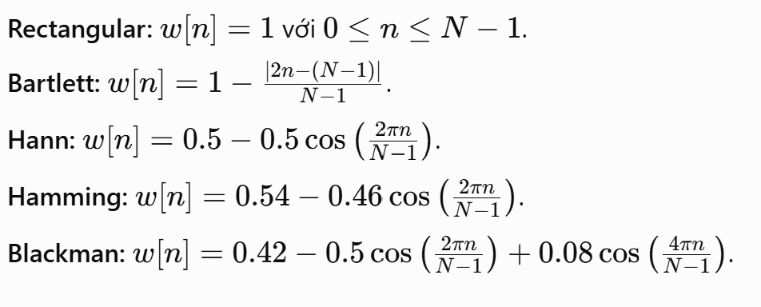

- Ưu nhược điểm


*Lưu ý: Trong thực tế, người ta hay dùng cửa sổ Hamming & Hanning cho FIR vì Giảm đáng kể búp sóng phụ so với cửa sổ chữ nhật, giúp đặc tính lọc dốc hơn.

### 1.3. Bộ lọc số thông thấp?

- Bộ lọc thông thấp (low-pass filter) là bộ lọc cho các thành phần tần số thấp đi qua và làm suy giảm các thành phần tần số cao. Bằng cách so sánh từng thành phần tần số với tần số cắt Wc=2pifc/fs:

	+ Nếu w<wc: thành phần đó được truyền qua gần như nguyên vẹn.

	+ Nếu w>wc: thành phần đó bị giảm biên độ mạnh.
	
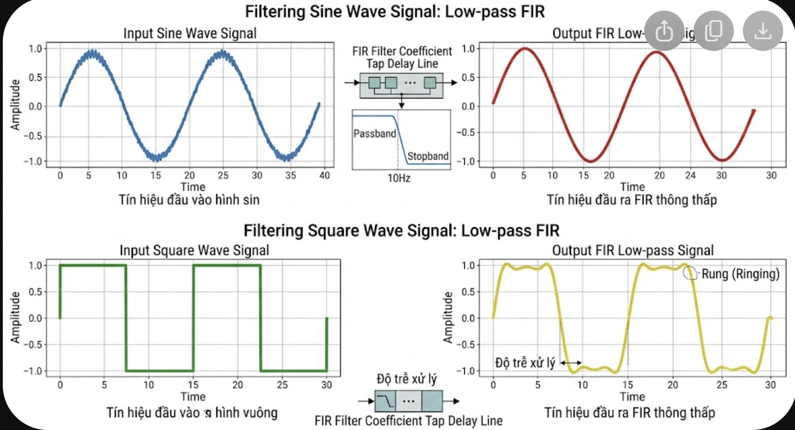

- Ví du: giả sử tín hiệu vào gồm 50Hz (tín hiệu mong muốn) và 1000Hz (nhiễu cao tần), sau khi đi qua bộ lọc thông thấp có wc=100Hz thì 50Hz gần như nguyên vẹn, và 1000Hz bị suy giảm mạnh => kết quả đầu ra chỉ còn 50Hz như mong muốn 

- Đáp ứng biên độ lý tưởng: 

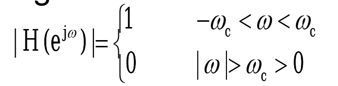

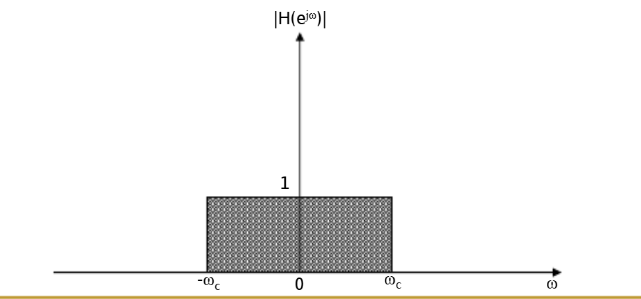

- Đáp ứng xung: 

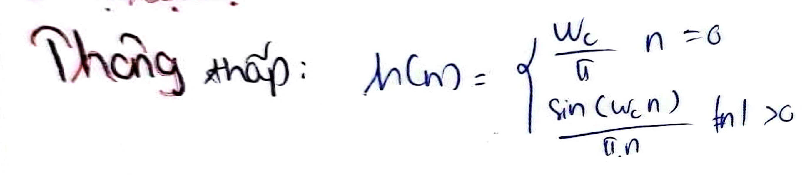

- Các bước tính toán bộ lọc FIR thông thấp

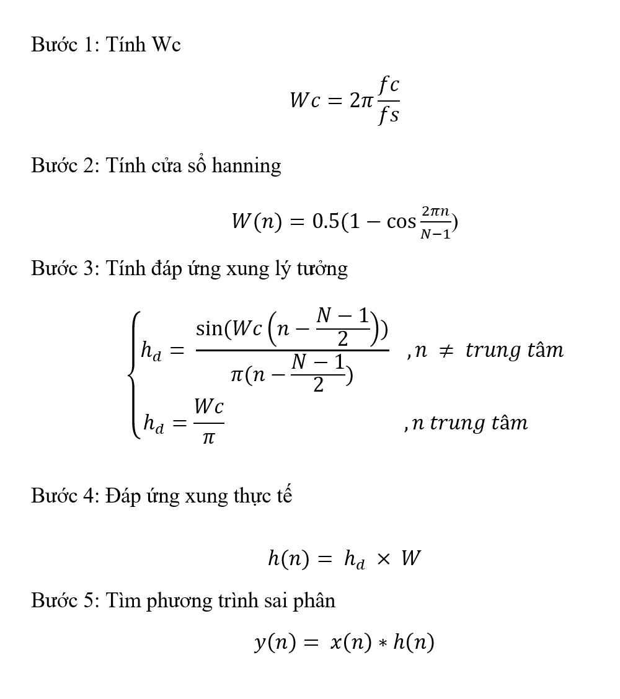

### 1.4. Bộ lọc số thông cao?

- Bộ lọc thông cao (high-pass filter) là bộ lọc cho các thành phần tần số cao đi qua và làm suy giảm các thành phần tần số thấp. Bằng cách so sánh từng thành phần tần số với tần số cắt Wc=2pifc/fs:

	+ Nếu w>wc: thành phần đó được truyền qua gần như nguyên vẹn.

	+ Nếu w<wc: thành phần đó bị giảm biên độ mạnh.

- Đáp ứng biên độ lý tưởng: 

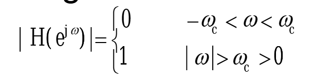

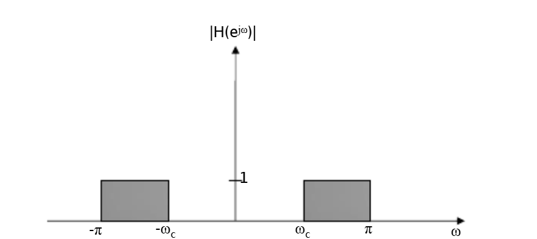

- Đáp ứng xung:

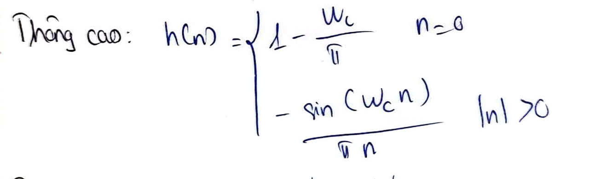

## 2. Bài tập

### 2.1. Bộ lọc FIR thông thấp

- Đề bài: Thiết kế bộ lọc FIR thông thấp pha tuyến tính dùng cửa sổ Hamming với N=11, wc=0,25.fs, đầu vào 16 bit, đầu ra 32 bit

-Code: 

```
module FIR_Hanning_11(
	input clk,
	input rst,
	input signed [15:0] data_in,
	output reg signed [31:0] data_out);
	
	parameter signed [15:0] h0 = 16'sd0;
   parameter signed [15:0] h1 = 16'sd0;
   parameter signed [15:0] h2 = -16'sd1201;
   parameter signed [15:0] h3 = 16'sd0;
   parameter signed [15:0] h4 = 16'sd9434;
	parameter signed [15:0] h5 = 16'sd16384;
	
	reg signed [15:0] x0, x1, x2, x3, x4, x5, x6, x7, x8, x9, x10;
   wire signed [31:0] y0, y1, y2, y3, y4, y5, y6, y7, y8, y9, y10;                    
   wire signed [31:0] temp1, temp2, temp3, temp4, temp5, temp6, temp7, temp8, temp9, temp10;           
    
	always @(posedge clk or posedge rst) begin
		if(rst) begin
			x0<=0;
			x1<=0;
			x2<=0;
			x3<=0;
			x4<=0;
			x5<=0;
			x6<=0;
			x7<=0;
			x8<=0;
			x9<=0;
			x10<=0;
		end
		else begin
			x0<=data_in;
			x1<=x0;
			x2<=x1;
			x3<=x2;
			x4<=x3;
			x5<=x4;
			x6<=x5;
			x7<=x6;
			x8<=x7;
			x9<=x8;
			x10<=x9;
		end
	end

   mult_fp mul0 (h0, x0, y0);
   mult_fp mul1 (h1, x1, y1);
   mult_fp mul2 (h2, x2, y2);
   mult_fp mul3 (h3, x3, y3);
   mult_fp mul4 (h4, x4, y4);
	mult_fp mul5 (h5, x5, y5);
   mult_fp mul6 (h4, x6, y6);
   mult_fp mul7 (h3, x7, y7);
   mult_fp mul8 (h2, x8, y8);
   mult_fp mul9 (h1, x9, y9);
	mult_fp mul10 (h0, x10, y10);

   add_fp add1 (y0, y1, temp1);
   add_fp add2 (temp1, y2, temp2);
   add_fp add3 (temp2, y3, temp3);
   add_fp add4 (temp3, y4, temp4); 
   add_fp add5 (temp4, y5, temp5);
   add_fp add6 (temp5, y6, temp6);
   add_fp add7 (temp6, y7, temp7); 
   add_fp add8 (temp7, y8, temp8);
   add_fp add9 (temp8, y9, temp9);
   add_fp add10 (temp9, y10, temp10); 
	
	always @(posedge clk or posedge rst) begin
		if(rst) begin
			data_out<=32'd0;
		end
		else begin
			data_out<=temp10;
		end
	end
endmodule 
```

- Testbench

```
module tb_FIR_Hanning_11;
	reg clk,rst;
	reg signed [15:0] data_in;
	wire signed [31:0] data_out;

	FIR_Hanning_11 dut(
		.clk(clk),
		.rst(rst),
		.data_in(data_in),
		.data_out(data_out));
		
	always #5 clk=~clk;

	initial begin
		rst=1;
		clk=0;
		data_in=16'sd0;
		#10;
		
		rst=0;
		@(posedge clk) data_in = 16'sd1;
      @(posedge  clk) data_in = 16'sd2;
      @(posedge  clk) data_in = 16'sd3;
      @(posedge  clk) data_in = 16'sd4;
      @(posedge  clk) data_in = 16'sd5;
      @(posedge  clk) data_in = 16'sd6;
      @(posedge  clk) data_in = 16'sd7;
      @(posedge  clk) data_in = 16'sd8;
      @(posedge  clk) data_in = 16'sd9;
      @(posedge  clk) data_in = 16'sd10;
		
		@(posedge  clk) data_in=16'sd0; 
		#150;

		$finish;
	end
endmodule 
```

### 2.2. Bộ lọc FIR thông cao  

- Đề bài: Thiết kế bộ lọc FIR thông cao pha tuyến tính dùng cửa sổ Hamming với N=11, wc=0,25.fs, đầu vào 16 bit, đầu ra 32 bit

-Code
```
module FIR_HPF_Hanning_11(
	input clk,
	input rst,
	input signed [15:0] data_in,
	output reg signed [31:0] data_out);
	
	parameter signed [15:0] h0 = 16'sd0;
   parameter signed [15:0] h1 = 16'sd0;
   parameter signed [15:0] h2 = 16'sd1201;
   parameter signed [15:0] h3 = 16'sd0;
   parameter signed [15:0] h4 = -16'sd9434;
	parameter signed [15:0] h5 = 16'sd16384;
	
	reg signed [15:0] x0, x1, x2, x3, x4, x5, x6, x7, x8, x9, x10;
   wire signed [31:0] y0, y1, y2, y3, y4, y5, y6, y7, y8, y9, y10;                    
   wire signed [31:0] temp1, temp2, temp3, temp4, temp5, temp6, temp7, temp8, temp9, temp10;           
    
	always @(posedge clk or posedge rst) begin
		if(rst) begin
			x0<=0;
			x1<=0;
			x2<=0;
			x3<=0;
			x4<=0;
			x5<=0;
			x6<=0;
			x7<=0;
			x8<=0;
			x9<=0;
			x10<=0;
		end
		else begin
			x0<=data_in;
			x1<=x0;
			x2<=x1;
			x3<=x2;
			x4<=x3;
			x5<=x4;
			x6<=x5;
			x7<=x6;
			x8<=x7;
			x9<=x8;
			x10<=x9;
		end
	end

   mult_fp mul0 (h0, x0, y0);
   mult_fp mul1 (h1, x1, y1);
   mult_fp mul2 (h2, x2, y2);
   mult_fp mul3 (h3, x3, y3);
   mult_fp mul4 (h4, x4, y4);
   mult_fp mul5 (h5, x5, y5);
   mult_fp mul6 (h4, x6, y6);
   mult_fp mul7 (h3, x7, y7);
   mult_fp mul8 (h2, x8, y8);
   mult_fp mul9 (h1, x9, y9);
	mult_fp mul10 (h0, x10, y10);

   add_fp add1 (y0, y1, temp1);
   add_fp add2 (temp1, y2, temp2);
   add_fp add3 (temp2, y3, temp3);
   add_fp add4 (temp3, y4, temp4); 
   add_fp add5 (temp4, y5, temp5);
   add_fp add6 (temp5, y6, temp6);
   add_fp add7 (temp6, y7, temp7); 
   add_fp add8 (temp7, y8, temp8);
   add_fp add9 (temp8, y9, temp9);
   add_fp add10 (temp9, y10, temp10); 
	
	always @(posedge clk or posedge rst) begin
		if(rst) begin
			data_out<=32'd0;
		end
		else begin
			data_out<=temp10;
		end
	end
endmodule 
```

-Testbench
```
module tb_FIR_HPF_Hanning_11;
	reg clk,rst;
	reg signed [15:0] data_in;
	wire signed [31:0] data_out;

	FIR_HPF_Hanning_11 dut(
		.clk(clk),
		.rst(rst),
		.data_in(data_in),
		.data_out(data_out));
		
	always #5 clk=~clk;

	initial begin
		rst=1;
		clk=0;
		data_in=16'sd0;
		#10;
		
		rst=0;
		@(posedge clk) data_in = 16'sd1;
      @(posedge clk) data_in = 16'sd2;
      @(posedge clk) data_in = 16'sd3;
      @(posedge clk) data_in = 16'sd4;
      @(posedge clk) data_in = 16'sd5;
      @(posedge clk) data_in = 16'sd6;
      @(posedge clk) data_in = 16'sd7;
      @(posedge clk) data_in = 16'sd8;
      @(posedge clk) data_in = 16'sd9;
      @(posedge clk) data_in = 16'sd10;
	  @(posedge clk) data_in = 16'sd1;
      @(posedge clk) data_in = 16'sd2;
      @(posedge clk) data_in = 16'sd3;
      @(posedge clk) data_in = 16'sd4;
      @(posedge clk) data_in = 16'sd5;
      @(posedge clk) data_in = 16'sd6;
      @(posedge clk) data_in = 16'sd7;
      @(posedge clk) data_in = 16'sd8;
      @(posedge clk) data_in = 16'sd9;
      @(posedge clk) data_in = 16'sd10;
		
		@(posedge  clk) data_in=16'sd0; 
		#150;

		$finish;
	end
endmodule 
```