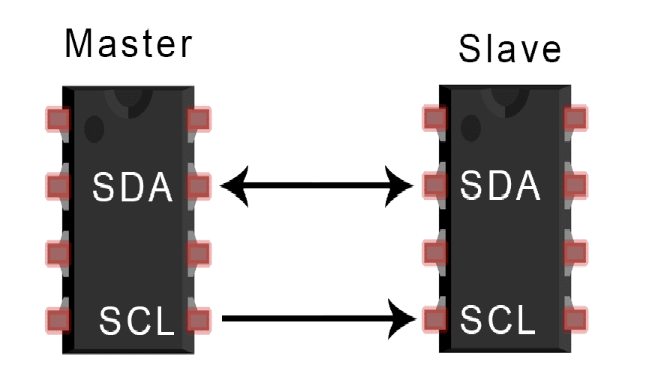
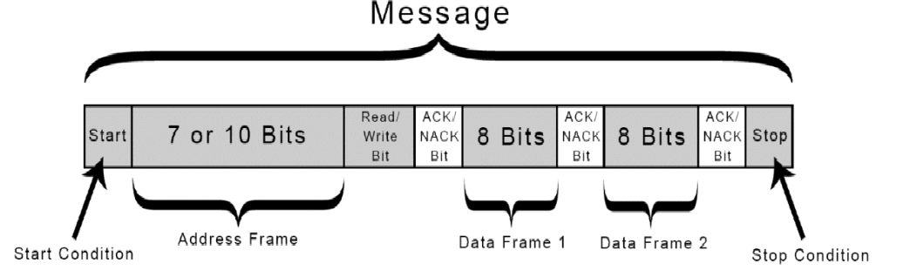
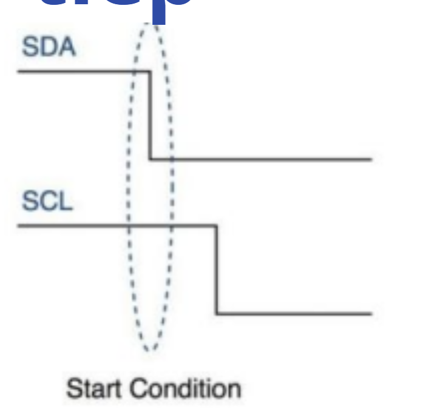
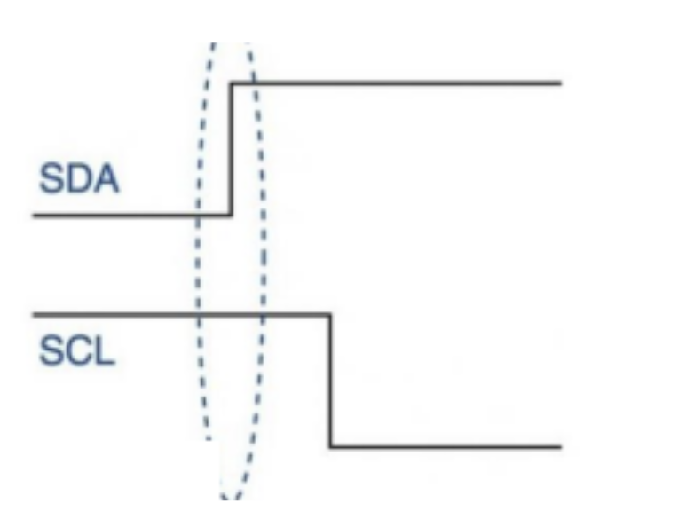
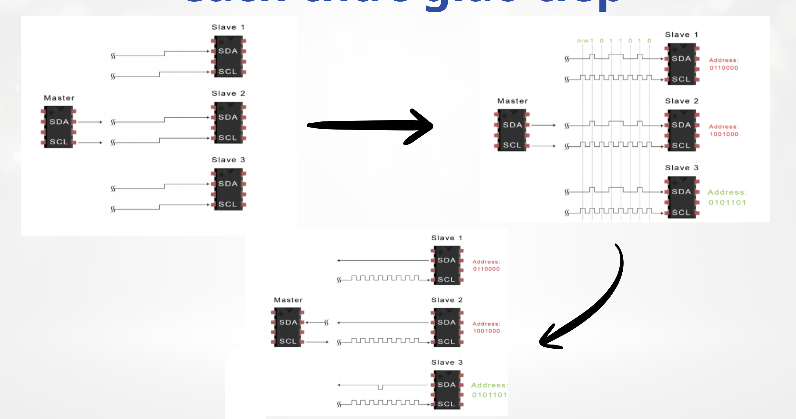
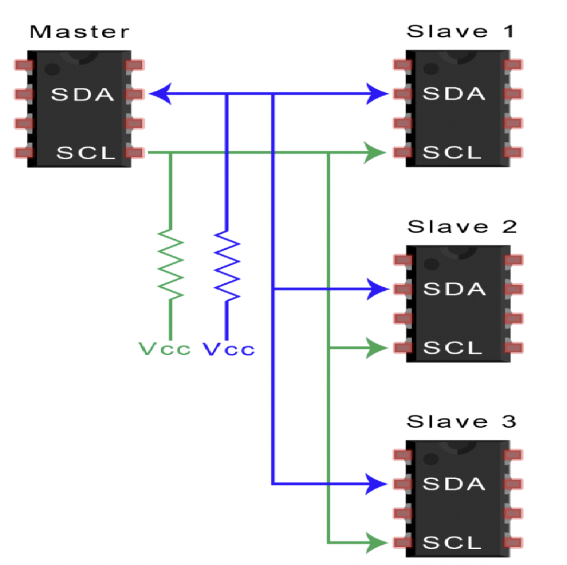
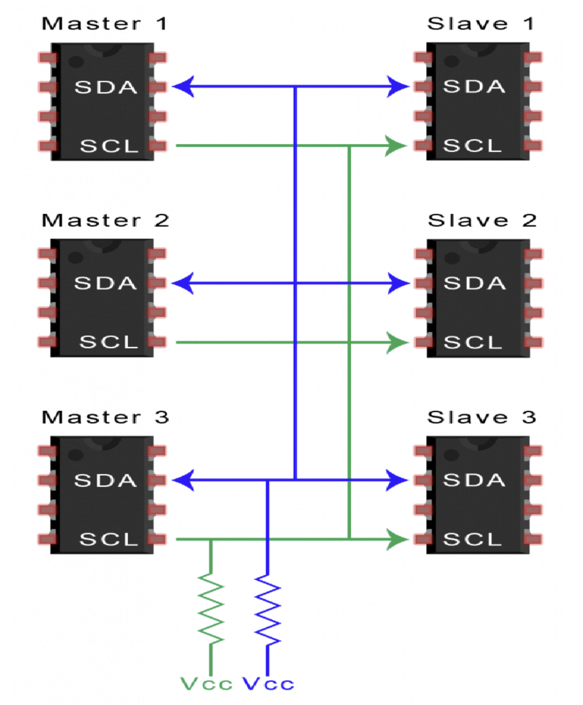

#I2C

## 1. Giao thức I2C

### 1.1. Giao thức I2C là gì?

- I2C là giao thức nối tiếp đồng bộ, cho phép vdk giao tiếp với nhiều thiết bị ngoại vi và dữ liệu được truyền theo từng bit 1. I2C chỉ sử dụng 2 dây dẫn: đường truyền dữ liệu (SDA) và đường xung nhịp đồng bộ (SCL)



- Trong 1 sơ đồ giao tiếp I2C:

	+ SDA: đường truyền đẻ master và slave gửi và nhận dữ liệu
	
	+ SCL: đường mang tín hiệu xung nhịp

	+ GND: nối chung 2 thiết bị xuống đất để lấy điện áp tham chiếu
	
### 1.2. Message

- Với I2C, dữ liệu được truyền trong các tin nhắn. Các tin nhắn này được chia thành các khung dữ liệu



	+ Điều kiện Start: Đường SDA kéo điện áo từ HIGH xuống LOW trước khi SCL chuyển từ HIGH xuống LOW
	
	
	
	+ Điều kiện Stop: Đường SDA kéo điện áo từ LOW lên HIGH trước khi SCL chuyển từ LOW lên HIGH
	
	
	
	+ Address Frame (Khung địa chỉ): Một chuỗi 7 hoặc 10 bit duy nhất cho mỗi slave để xác định slave khi master muốn giao tiếp với nó
	
	+ Read/Write Bit: Một bit chỉ định của master gửi đến slave
	
		_ bit 0: (Write) Ghi dữ liệu (master gửi dữ liệu slave)
		
		_ bit 1: (Read) Đọc dữ liệu (master yêu cầu dữ liệu từ slave -> slave gửi dữ liệu cho master)
		
	+ ACK/NACK Bit: Một bit xác nhận xem đã gửi thành công dữ liệu chưa	
		
		_ bit 0: ACK (đã nhận thành công dữ liệu)
		
		_ bit 1: NACK
		
	
		
	+ Data Frame (Khung dữ liệu): Một chuỗi 8 bit chứa dữ liệu mong muốn nhận/gửi từ master/slave
	
### 1.3. Một master với nhiều slave



- Một master có thể đọc/ghi dữ liệu từ nhiều slave bằng cách xác định đúng adddress frame trong Message

### 1.4. Nhiều master với nhiều slave



- Nếu 2 master Start tại cùng 1 thời điểm, muốn yêu cầu cùng đọc/ghi dữ liệu tại cùng 1 slave sẽ xảy ra Arbitration (phân xử bus)

	+ Vì I2C cùng open-drain, nên master yêu cầu Write luôn thắng (được truyền dữ liệu trước)
	
	+ Master thua sẽ dừng điểu khiển SDA, chuyển sang chỉ theo dõi bus chờ Master thắng truyền xong, khi bus rảnh sẽ truyền lại mà KHÔNG CẦN RESET BUS VÀ DỮ LIỆU 
	
## 2. I2C 

- Code

```
module I2C(
	input wire clk,
	input wire rst,
	output reg i2c_sda,
	output reg i2c_scl);
	
	localparam STATE_IDLE = 0;
	localparam STATE_START = 1;
	localparam STATE_ADDR = 2;
	localparam STATE_RW = 3;
	localparam STATE_ACK = 4;
	localparam STATE_DATA = 5;
	localparam STATE_NACK = 6;
	localparam STATE_STOP = 7;
	
	reg [2:0] state;
	reg [6:0] addr;
	reg [7:0] count;
	reg [7:0] data;
	
	always @(posedge clk) begin
		if(rst) begin
			state <= 0;
			i2c_sda <= 1'b1;
			i2c_scl <= 1'b1;
			data <= 8'hA5; //example Data = 10100101
			addr <= 7'h50; //dia chi mac dinh cua mot so thiet bi i2c (EEPROM) = 1010000
			count <= 8'd0;
		end
		
		else begin
			case(state)
				STATE_IDLE: begin 
					i2c_sda <= 1'b1;
					i2c_scl <= 1'b1;
					state <= STATE_START;
				end
				
				STATE_START: begin
					i2c_scl <= 1'b1;
					i2c_sda <= 1'b0;
					state <= STATE_ADDR;
					count <= 6;
				end
				
				STATE_ADDR: begin
					i2c_scl <= 1'b0;
					i2c_sda <= addr[count];
					if(count==0) state <= STATE_RW;
					else count <= count-1;
				end
				
				STATE_RW: begin
					i2c_scl <= 1'b0;
					i2c_sda <= 1'b0; //Write
					state <= STATE_ACK;
				end
				
				STATE_ACK: begin
					state <= STATE_DATA;
					count <= 7;
				end
				
				STATE_DATA: begin
					i2c_scl <= 1'b0;
					i2c_sda <= data[count];
					if(count==0) state <= STATE_NACK;
					else count <= count - 1;
				end
				
				STATE_NACK: begin
					state <= STATE_STOP;
				end
				
				STATE_STOP: begin
					i2c_scl <= 1'b1;
					i2c_sda <= 1'b1;
					state <= STATE_IDLE;
				end
				
				default: 
					state <= STATE_IDLE;
			endcase
		end
	end

endmodule 
					
```

-TB

```
module I2C_tb;

    reg clk;
    reg rst;

    wire i2c_sda;
    wire i2c_scl;
	 
    I2C dut(
        .clk(clk),
        .rst(rst),
        .i2c_sda(i2c_sda),
        .i2c_scl(i2c_scl));

    initial begin
        clk = 0;
        forever #5 clk = ~clk;
    end

    initial begin
        rst = 1;

        #20;
        rst = 0;

        #400;// Chạy mô phỏng thêm

        $stop;
    end

endmodule
```
	