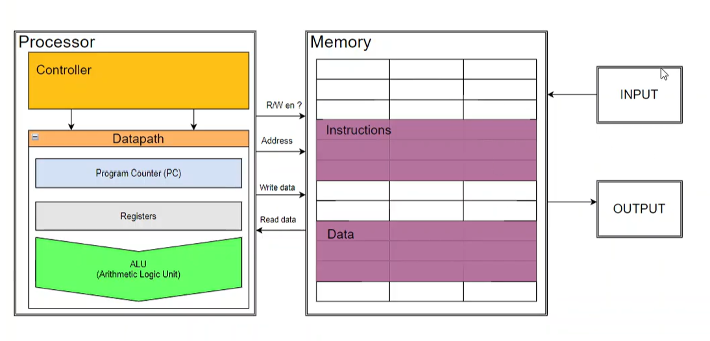
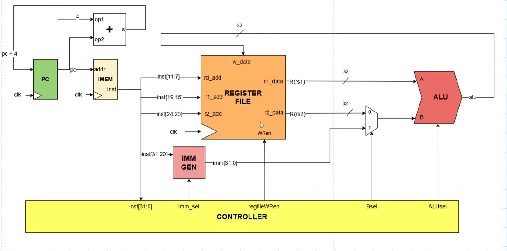
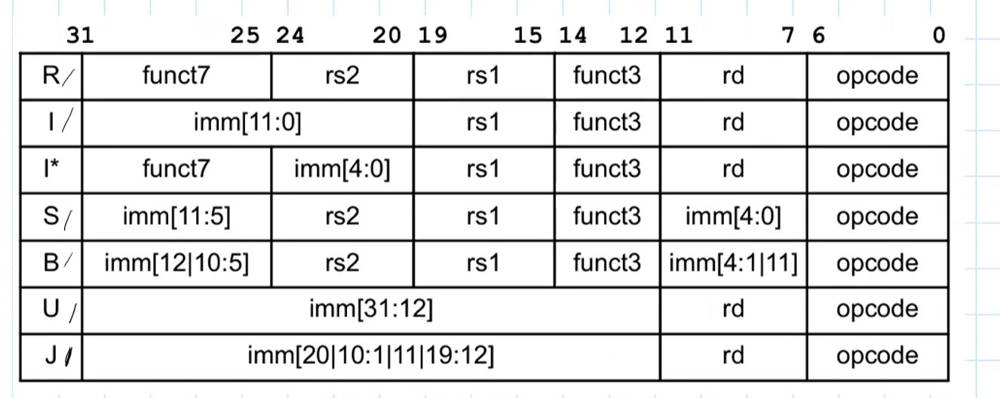
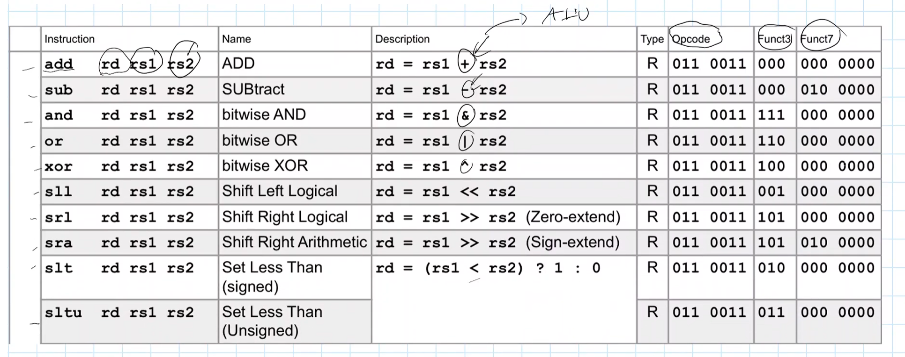

# RISC-V Cơ bản

## 1. Tổng quan

- ISA (Instruction Set Architecture) (kiến trúc tập lênh) 

  + Closed ISA: ISA thuộc quyền kiểm soát của một công ty/tổ chức, việc sử dụng hoặc tự thiết kế CPU tương thích thường cần giấy phép.
  
  + Open ISA: đặc tả mở, điển hình là RISC - việc

## 2. RISC - V cơ bản

- Kiến trúc tổng quát của một hệ thống 

### 2.1. CPU là gì?

- CPU (Central Processing Unit) là bộ xử lí trung tâm, là phần cứng có nhiệm vụ đọc và thực thi các instruction

- CPU của Risc-v bao gồm:

	+ Controller: Bộ điều khiển trung tâm, nhận và giải mã instruction, sinh ra các tín hiệu điều khiển cho Datapath như RegWEn, BSel, ALUSel, ImmSel...
	
	+ Datapath: Thực thi chức năng, cập nhật trạng thái, chuyển tiếp dữ liệu di chuyển qua các thanh ghi
	
		_ PC: Con trỏ lấy địa chỉ
		
		_ Register: thanh ghi x0->x31 (x0 là hardwired gắn cứng, không thể thay đổi giá trị)
		
		_ ALU: khối thực hiện các toán hạng, toán logic
		
	+ Memory: Bộ nhớ lưu trữ kết quả/ dữ liệu được tạo ra từ CPU, những thứ CPU cần để chạy chương trình (muốn truy cập vào thì cần địa chỉ)
	
		_ Instructions: Chưa lệnh chương trình mà CPU cần chạy
		
		_ Data: dữ liệu
	
### 2.2. Datapth I (IPC=1,RVI 32)

#### 2.2.1. Tổng quan:

- Đây là 1 CPU đơn chu kì, tức là thực hiện lệnh = cập nhật trạng thái trong 1 chu kì

- Đầu ra hiện tại là đầu vào hệ tổ hợp, kết quả của nó sẽ cập nhật vào các thanh ghi trạng thái tại cạnh lên clk

#### 2.2.2. Các khối trạng thái

- Khối PC: là thanh ghi 32 bit, chứa địa chỉ của instruction, PC đưa địa chỉ cho Memory

	+ thông thường PC_next = PC+4 vì RV32I dài 32bit=4 byte

- Khối IMEM: (chứa instruction của chương trình)bộ nhớ chỉ đọc

=> PC trỏ địa chỉ ở IMEM -> IMEM lấy lệnh theo đúng address mong muốn đó đưa RF hoạt động

- Khối Register File (chứa tập hợp thanh ghi 0->31), có thể đọc(0) và ghi(1) tùy mong muốn 

	+ muốn truy cập cần đọc địa chỉ: inst[19:15] → rs1-thanh ghi nguồn 1, inst[24:20] → rs2-thanh ghi nguồn 2, inst[11:7]  → rd-thanh ghi đích
 
	+ Đọc: cung cấp địa chỉ thanh ghi hợp lệnh
	
	+ Ghi: vẫn phải cung cấp địa chỉ thanh ghi mong muốn ghi, nhưng dữ liệu ghi cần chuẩn bị trước wr_en và clk
	
- Khối ALU: tính toán toán hạng, toán logic (add,sub,and,or,xor...)

- VD: chạy lệnh add x10, x1, x2

	+ PC trỏ địa chỉ đúng của khối IMEM chứa lệnh add
	
	+ istr trong IMEM biết và kéo xuống controller tạo hdsd cho RF, sau đó lấy dữ liệu của r1 và r2 cho ALU tính toán rồi viết vào RF(w_data) -> rd=r10
	
- IMM Gen (vdFormat i): ở đây giá trị i là giá trị tức thời được tạo ra không chứa trong thanh ghi

	VD: addi x10, x1, i

## 3. Tập lệnh (Format)

- Máy tính không hiểu những ngôn ngữ bậc cao -> compiler cề bậc thấp thành assembly/mã máy (nhị phân) để hiểu

- Khi viết add x10, x1, x2 thì CPU không trực tiếp nhìn câu lệnh mà biến nó thành một instruction 32bit để biết lệnh gì, đọc thanh ghi nào, ghi thanh ghi nào và ALU cần cộng hay trừ 

