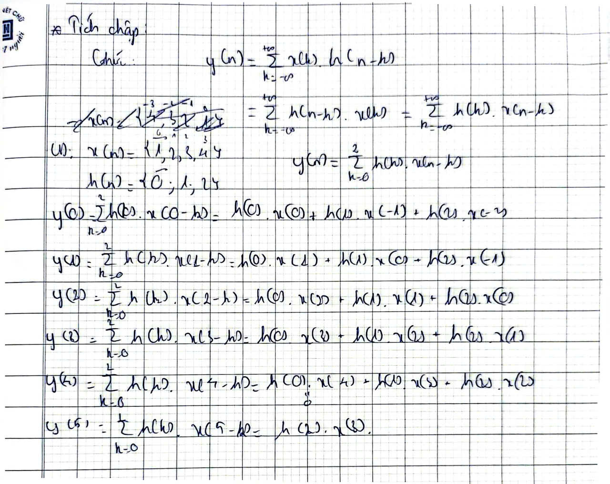
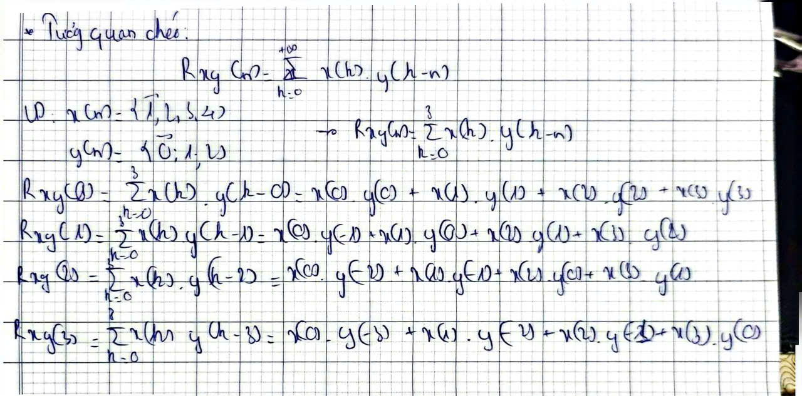
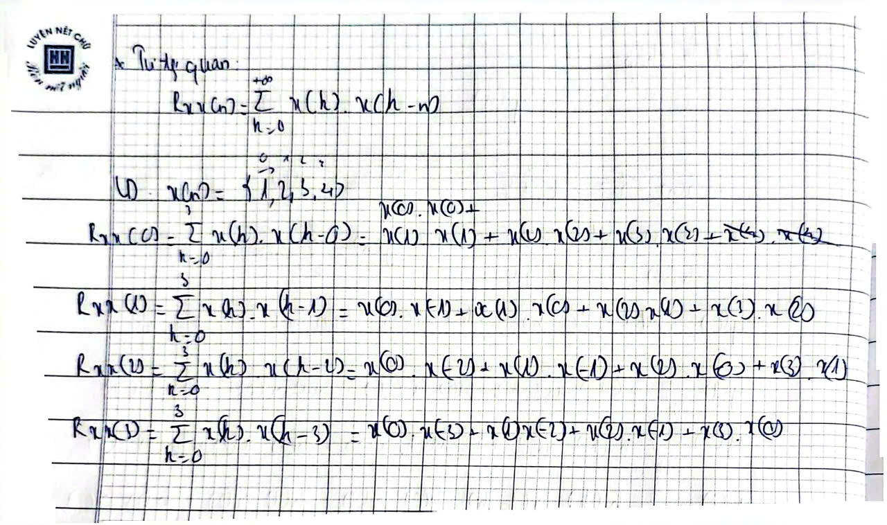

# Tích chập và Phép Tương quan

## 1. Tích chập (https://machinelearningcoban.com/2018/10/03/conv2d)



## 2. Tương quan chéo

 

## 3. Tự tương quan



## 4. Code

### 4.1. Tích chập

- Code:

```
module Convolution(
	input clk,
	input rst,
	input [15:0] data_in,
	output reg [31:0] data_out);
	
	reg signed [15:0] x0,x1,x2;
	wire signed [15:0] H0,H1,H2;

	assign H0=16'd0;
	assign H1=16'd1;
	assign H2=16'd2;
	
	always @(posedge clk or posedge rst) begin
		if(rst) begin
			x0<=0;
			x1<=0;
			x2<=0;
		end
		else begin
			x0<=data_in;
			x1<=x0;
			x2<=x1;
		end
	end
	
	wire signed [31:0] conv0, conv1, conv2;
	assign conv0 = x0*H0;
	assign conv1 = x1*H1;
	assign conv2 = x2*H2;
	
	always @(posedge clk or posedge rst) begin
		if(rst) begin
			data_out<=0;
		end
		else begin
			data_out=conv0 + conv1 + conv2;
		end
	end
	
endmodule 
```

-Testbench
```
module tb_convolution;
	reg clk;
	reg rst;
	reg [15:0] data_in;
	wire [31:0] data_out;
	
Convolution dut(
	.clk(clk),
	.rst(rst),
	.data_in(data_in),
	.data_out(data_out));

always #5 clk=~clk;
	
initial begin
	clk=0;
	rst=1;
	data_in=16'd0;
	#10;
	
	rst=0;
	data_in=16'd1; #50;
	data_in=16'd2; #50;
	data_in=16'd3; #50;
	data_in=16'd4; #50;
	data_in=16'd0;
	
	#20;
	$finish;
end
endmodule
```

### 4.2. Tuong quan cheo

- Code
```
module cr_correlation(
	input clk,
	input rst,
	input signed [15:0] data_in,
	output reg signed [31:0] data_out);

	reg signed [15:0] x0,x1,x2;
	wire [15:0] y0,y1,y2;
	assign y0=16'd0;
	assign y1=16'd1;
	assign y2=16'd2;
	
	always @(posedge clk or posedge rst) begin
		if(rst) begin
			x0<=0;
			x1<=0;
			x2<=0;
		end
		else begin
			x0<= data_in;
			x1<=x0;
			x2<=x1;
		end
	end

	wire signed [31:0] crc0,crc1,crc2;
	assign crc0= x2*y0;
	assign crc1= x1*y1;
	assign crc2= x0*y2;
	
	always @(posedge clk or posedge rst) begin
		if(rst) begin
			data_out<=32'd0;
		end
		else begin
			data_out<=crc0+crc1+crc2;
		end
	end

endmodule 
```

- Testbench
```
module tb_cr_correlation;
	reg rst;
	reg clk;
	reg [15:0] data_in;
	wire [31:0] data_out;

cr_correlation uut(
	.rst(rst),
	.clk(clk),
	.data_in(data_in),
	.data_out(data_out));

always #5 clk=~clk;

initial begin 
	clk=0;
	rst=1;
	data_in=16'd0;
	#10
	
	rst=0;
	data_in=16'd1; #50;
	data_in=16'd2; #50;
	data_in=16'd3; #50;
	data_in=16'd4; #50;
	data_in=16'd0;
	
	#20;
	$finish;
end
endmodule
```

### 4.3. Tự tương quan

-Code
```
module auto_correlation(
    input clk,
    input rst,
    input signed [15:0] data_in,
    
    output reg signed [31:0] Rxx_lag0,
    output reg signed [31:0] Rxx_lag1,
    output reg signed [31:0] Rxx_lag2);

    reg signed [15:0] x0, x1, x2;

    always @(posedge clk or posedge rst) begin
        if(rst) begin
            x0 <= 16'd0;
            x1 <= 16'd0;
            x2 <= 16'0;
        end 
		  else begin
            x0 <= data_in; 
            x1 <= x0; 
            x2 <= x1; 
        end
    end

    wire signed [31:0] mult_lag0 = x0 * x0;
    wire signed [31:0] mult_lag1 = x0 * x1; 
    wire signed [31:0] mult_lag2 = x0 * x2;
	 
    always @(posedge clk or posedge rst) begin
        if(rst) begin
            Rxx_lag0 <= 32'sd0;
            Rxx_lag1 <= 32'sd0;
            Rxx_lag2 <= 32'sd0;
        end 
		  else begin
            Rxx_lag0 <= Rxx_lag0 + mult_lag0; 
            Rxx_lag1 <= Rxx_lag1 + mult_lag1;
            Rxx_lag2 <= Rxx_lag2 + mult_lag2;
        end
    end
    
endmodule
```

-Testbench
```
module tb_auto_correlation();
	reg clk;
	reg rst;
	reg [15:0] data_in;
	wire [31:0] Rxx_lag0;
	wire [31:0] Rxx_lag1;
   wire [31:0] Rxx_lag2;
	
auto_correlation(
	.clk(clk),
	.rst(rst),
	.data_in(data_in),
	.Rxx_lag0(Rxx_lag0),
	.Rxx_lag1(Rxx_lag1),
	.Rxx_lag2(Rxx_lag2));

always #5 clk=~clk;

initial begin
	clk=0;
	rst=1;
	data_in=16'd0;
	#10;
	
	rst=0;
	data_in=16'd1; #5;
	data_in=16'd2; #5;
	data_in=16'd3; #5;
	data_in=16'd4; #5;
	data_in=16'd0;
	
	#20;
	$finish;
end
endmodule
```