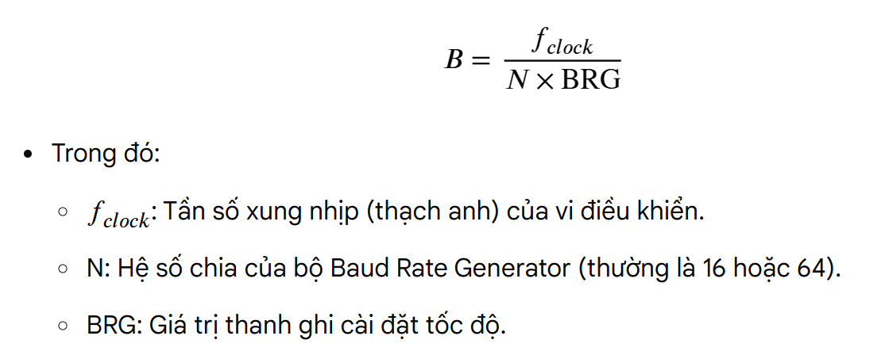
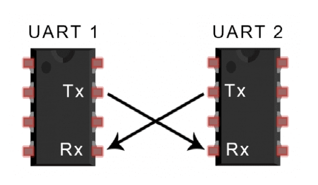
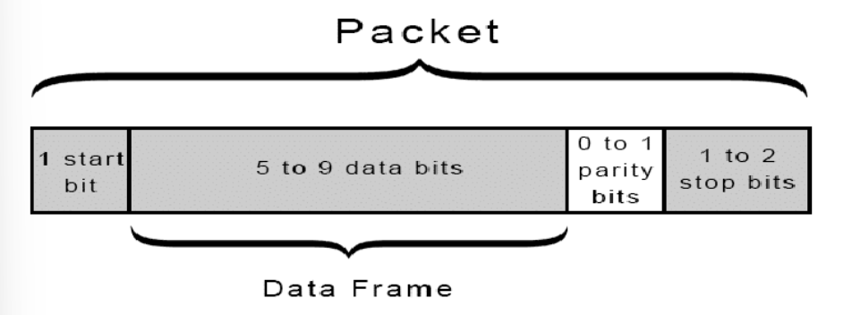
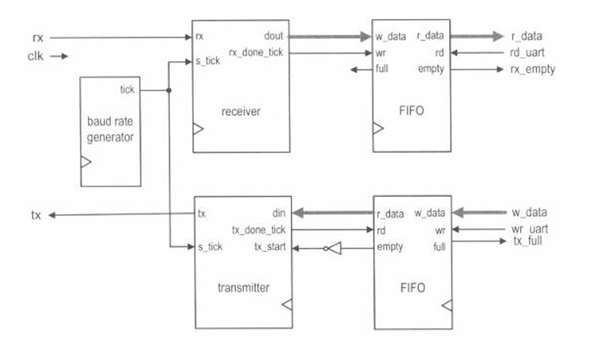

#UART

## 1. Giao thức UART

### 1.1. Giao thức Uart là gì?

- Uart là bộ thu-phát không đồng bộ (không cần xung clk chung giữa master và slave) nên phải chugn baudrate, cho phép vi điều khiển/thiết bị truyền thông trao đổi dữ liệu nối tiếp (từng bit một) qua lại với nhau.

- Cách tính Baudrate 





- Trong 1 sơ đồ giao tiếp UART

	+ Tx: chân truyền dữ liệu
	
	+ Rx: chân nhận dữ liệu
	
	+ GND: nối chung 2 thiết bị xuống đất để lấy điện áp tham chiếu
	
	+ Dữ liệu truyền đến và đi từ UART song song với thiết bị điều khiển 
	
- 3 chế độ truyền dữ liệu nối tiếp:

	+ Full duplex: giao tiếp đồng thời đến và đi từ mỗi master và slave
	
	+ Half duplex: Dữ liệu đi theo một hướng tại một thời điểm
	
	+ Simplex: Chỉ giao tiếp một chiều
	
### 1.2. Data Frame



- Bit bắt đầu (1 start bit): Khi không truyền dữ liệu thì luôn giữ điện áp ở mức HIGH, để bắt đầu truyền dữ liệu thì Uart truyền sẽ kéo điện áp xuống mức LOW trong 1 chu kì clock

- Data frame:

	+ chứa từ 5->8 bit dữ liệu nếu sử dụng bit chẵn lẻ
	
	+ 9 bit nếu không dùng bit chẵn lẻ
	
- Bit chẵn lẻ: nhận biết dữ liệu thay đổi trong quá trình truyền bằng cách đếm số bit có giá trị là 1 và kiểm tra tổng số là chẵn hay lẻ

- Bit dừng: báo hiệu sự kết thúc gói dữ liệu bằng cách kéo điện áp từ LOW lên HIGH trong ít nhất khoảng 2 bit

## 2. Giao thức UART trong Verilog



### 2.1. UART Transmitter

- Khối này lấy dữ liệu song song từ bộ đệm FIFO và chuyển đổi thành chuỗi bit nối tiếp để truyền đi, sử dụng chung đồng hồ s_tick

#### 2.1.1. Cấu trúc chính

- Ngõ vào din: Nhận dữ liệu song song (byte cần truyền) từ ngõ ra r_data của FIFO truyền

- Ngõ vào s_tick: Xung nhịp đồng hồ từ Baudrate, quy định tốc độ dịch bit

- Ngõ vào tx_start: Tín hiệu kích hoạt truyền (Chân được nối qua cổng NOT từ chân empty của FIFO (~empty), điều này nghĩa là chỉ cần FIFO có dữ liệu (không empty) thì mạch sẽ tự động bắt đầu truyền)

- Ngõ ra tx_done_tick: Xung báo hiệu đã truyền xong một byte, được nối ngược lại chân rd (read) của FIFO để yêu cầu FIFO đẩy ra byte tiếp theo

- Ngõ ra tx: Đường truyền tín hiệu nối tiếp ra bên ngoài

#### 2.1.2. Quy trình truyền dữ liệu

- Khi hệ thống ghi dữ liệu vào FIFO truyền, FIFO không rỗng (empty=0), đi qua cổng NOT, tín hiệu tx_start kích lên 1

- Transmitter chốt dữ liệu từ din vào thanh ghi dịch của UART TX

- Mạch kéo đường tx xuống mức 0 để tạo bit START, giữ độ rộng bit thông qua việc đếm các xung s_tick

- Transmitter lần lượt đưa các bit dữ liệu ra chân tx, mỗi bit được giữ vững trong đúng 1 chu kỳ baud (tương ứng với số xung s_tick quy định).

- Cuối cùng, mạch đưa chân tx lên mức 1 để tạo bit STOP. Sau đó mạch phát một xung tx_done_tick. Xung này "đọc" (pop) phần tử tiếp theo trong FIFO, quy trình lặp lại nếu FIFO vẫn còn dữ liệu.

### 2.2 UART Receiver

- Khối này nhận tín hiệu nối tiếp từ đường truyền, giải mã thành dữ liệu song song và đẩy vào bộ đệm FIFO để hệ thống (CPU) đọc sau.

#### 2.2.1. Cấu trúc chính

- Ngõ vào rx: Đường nhận tín hiệu nối tiếp từ bên ngoài.

- Ngõ vào s_tick: Xung nhịp lấy mẫu từ Baud Rate (dùng để đo đếm thời gian và định vị chính xác điểm giữa của mỗi bit).

- Ngõ ra dout: Dữ liệu song song (thường là 8 bit) sau khi được giải mã, nối trực tiếp vào ngõ vào w_data của FIFO nhận.

- Ngõ ra rx_done_tick: Xung báo hiệu đã nhận hoàn tất một khung dữ liệu hợp lệ. Xung này được nối vào chân wr (write) của FIFO để ra lệnh lưu dữ liệu từ dout vào bộ đệm.

#### 2.2.2. Quy trình nhận dữ liệu

- Khối receiver liên tục lấy mẫu đường rx thông qua các xung s_tick. Khi rx đột ngột giảm xuống 0, nó nhận diện đây có thể là bit START.

- Mạch đếm số xung s_tick (thường đếm đến nửa chu kỳ bit, ví dụ 8 xung nếu oversampling là 16x) để kiểm tra lại mức logic của rx. Nếu vẫn là 0, bit START được xác nhận là hợp lệ để tránh nhiễu.

- Bộ thu tiếp tục đếm s_tick để lấy mẫu chính xác tại "điểm giữa" của các bit dữ liệu tiếp theo, dịch từng bit vào một thanh ghi nội bộ.

- Sau khi lấy mẫu đủ các bit dữ liệu và kiểm tra xong bit STOP (chờ rx lên 1), mạch xuất dữ liệu song song ra dout, đồng thời phát một xung lên rx_done_tick để đẩy byte này vào FIFO lưu trữ.

## 3. Mô phỏng trên Quaruts

### 3.1. UART Top

```
module uart#( 
	parameter CLK_FRE = 50000000, BAUD_RATE = 115200)
	(input clk,rst,start, 
	input rx, 
	output tx, 
	output reg busy );
	reg start_rx,start_tx; 
	wire busy_tx,busy_rx; 
	wire [7:0] data_rx; 
	reg [7:0] data_tx; 
	reg flag_0,flag_1,flag_2,flag,flag_1_0; 
	uart_rx #(.CLK_FRE(50000000),  
		 .CLK_UART(115200)) 
		rx_module ( 
	  .clk(clk), 
	  .rst(rst), 
	  .rx(rx), 
	  .enable(start_rx), 
	  .rx_done(busy_rx), 
	  .rx_out(data_rx)); 
	 uart_tx #(.CLK_FRE(50000000), 
		 .CLK_UART(115200)) 
	   tx_module( 
	  .clk(clk), 
	  .rst(rst), 
	  .enable(start_tx), 
	  .tx(tx), 
	  .data_in(data_tx), 
	  .busy_tx(busy_tx) ); 
 always@(posedge clk or negedge rst)begin 
    if(!rst)begin 
        start_rx <= 0; 
        start_tx <= 0; 
        flag_0   <= 0; 
        flag_1   <= 0; 
        flag_2   <= 0; 
        flag_1_0 <= 0; 
        flag     <= 1; 
        busy     <= 0; 
    end 
	else begin 
        if(start&&flag)begin 
            flag_0   <= 1; 
            start_rx <= 1; 
            flag     <= 0; 
            busy     <= 1;  
        end 
        if(flag_0&&busy_rx)begin 
            flag_0 <= 0; 
            flag_1_0 <= 1; 
            //data_tx <= data_rx; 
            start_tx <= 1; 
        end  
        if(flag_1_0)begin 
            flag_1_0 <= 0; 
            flag_1   <= 1; 
            data_tx <= data_rx; 
        end 
        if(flag_1&&busy_tx)begin 
            flag_1 <= 0; 
            flag_2 <= 1; 
        end 
        if(flag_2)begin 
            flag   <= 1; 
            flag_2 <= 0; 
            start_tx <= 0; 
            start_rx <= 0; 
            busy     <= 0; 
        end 
    end 
 end 
endmodule
```

### 3.2. UART Rx

```
module uart_rx#( 
	  parameter CLK_FRE = 50000000, CLK_UART = 115200 )
	( input clk, rst, rx, enable, 
	 output reg rx_done, 
	 output reg [7:0] rx_out ); 
	 //parameter CLK_FRE = 50000000, CLK_UART = 115200; 
	 reg [15:0] counter; 
	 reg data_re, flag; 
	 reg [9:0] mem_buffer; 
  
	always @(posedge clk or negedge rst) begin  
	  if (!rst) begin 
		   rx_done <= 0; 
		   mem_buffer <= 0; 
		   counter <= 0; 
		   data_re <= 0; 
		   rx_out <= 8'hff; 
		   flag <= 0; 
		end 
		else if (enable) begin 
	   if (counter == 16'd0 && rx == 1'b0) begin 
		data_re <= 1'b1; 
	   end 
	   else if (data_re) begin 
			case (counter)  
			 CLK_FRE/(CLK_UART*2) * 1: mem_buffer[0] <= rx; 
			 CLK_FRE/(CLK_UART*2) * 3: mem_buffer[1] <= rx; 
			 CLK_FRE/(CLK_UART*2) * 5: mem_buffer[2] <= rx; 
			 CLK_FRE/(CLK_UART*2) * 7: mem_buffer[3] <= rx; 
			 CLK_FRE/(CLK_UART*2) * 9: mem_buffer[4] <= rx; 
			 CLK_FRE/(CLK_UART*2) * 11: mem_buffer[5] <= rx; 
			 CLK_FRE/(CLK_UART*2) * 13: mem_buffer[6] <= rx; 
			 CLK_FRE/(CLK_UART*2) * 15: mem_buffer[7] <= rx; 
			 CLK_FRE/(CLK_UART*2) * 17: mem_buffer[8] <= rx; 
			 CLK_FRE/(CLK_UART*2) * 19: begin 
				  mem_buffer[9] <= rx; 
				  data_re <= 1'b0; 
				  flag <= 1; 
				  rx_done <= 1; 
				 end 
			endcase 
	   end 
	   if (data_re) begin 
			counter <= counter + 1; 
	   end 
	   else begin 
			rx_done <= 0; 
			counter <= 0; 
			if (flag) begin 
			 rx_out <= mem_buffer[8:1]; 
			 flag <= 0; 
		end 
		mem_buffer <= 0; 
	   end 
	  end 
	 end 
 
endmodule
```

### 3.3. UART TX

```
module uart_tx#( 
	 parameter CLK_FRE = 50000000, CLK_UART = 115200)
	 ( input clk, rst, enable, 
	 input [7:0] data_in, 
	 output reg busy_tx, tx ); 
	 reg [15:0] counter2, counter4; 
	 reg flag; 
	 reg [7:0] mem; 
	 reg [7:0] mem_buffer1; 
	 reg [15:0] tx_counter; 
always @(posedge clk or negedge rst) begin 
	if (!rst) begin 
		mem <= 8'b00000000; 
	   busy_tx <= 0; 
	   mem_buffer1 <= 0; 
	   tx <= 1'b1;    
	   counter2 <= 16'd0; 
	   counter4 <= 16'd0;   
	   flag <= 0; 
	   tx_counter <= 4'd0;    
	end 
	else if (enable) begin 
		mem <= data_in[7:0]; 
		if (tx_counter < 16'd1) begin 
			mem_buffer1 <= mem; 
			case (counter2)  
				CLK_FRE/CLK_UART * 0 : tx <= 0; 
				CLK_FRE/CLK_UART * 1 : tx <= mem_buffer1[0]; 
											mem_buffer1[1]; 
											mem_buffer1[2]; 
											mem_buffer1[3]; 
											mem_buffer1[4]; 
											mem_buffer1[5]; 
											mem_buffer1[6]; 
											mem_buffer1[7]; 
				CLK_FRE/CLK_UART * 2 : tx <= 
				CLK_FRE/CLK_UART * 3 : tx <= 
				CLK_FRE/CLK_UART * 4 : tx <= 
				CLK_FRE/CLK_UART * 5 : tx <= 
				CLK_FRE/CLK_UART * 6 : tx <= 
				CLK_FRE/CLK_UART * 7 : tx <= 
				CLK_FRE/CLK_UART * 8 : tx <= 
				CLK_FRE/CLK_UART * 9 : begin 
					tx <= 1; 
					counter2 <= 16'd0; 
					tx_counter <= tx_counter + 1; 
					// counter4 <= counter4 + 1;  
				end 
			endcase 
			counter2 <= counter2 + 16'd1; 
		end 
		else begin 
			tx <= 1; 
			busy_tx <= 1; 
		end 
	end  
	else begin 
	   tx    <= 1'b1;  
	   counter2  <= 16'd0; 
	   counter4  <= 16'd0;   
	   flag   <= 0; 
	   busy_tx  <= 0; 
	   tx_counter  <= 16'd0;   
	   mem   <= 8'b00000000; 
	end 
end 

endmodule 
```

### 3.4. Testbench

```
module tb_uart; 
	reg clk,rst,start; 
	reg rx; 
	wire tx; 
	wire busy; 
	localparam CLK_PERIOD = 20;        
	localparam CLK_FRE = 50;           
	localparam BAUD_RATE = 115200;     
	localparam CYCLE = CLK_FRE * 1000000 / BAUD_RATE;   
	uart #( 
		.CLK_FRE(50000000), 
		.BAUD_RATE(115200) ) 
	uut ( 
		.clk(clk), 
		.rst(rst), 
		.start(start), 
		.rx(rx), 
		.tx(tx), 
		.busy(busy) ); 
	initial begin 
		clk = 0; 
		forever #(CLK_PERIOD/2) clk = ~clk;   
	end 
	initial begin 
		start = 1; 
		rst = 0;   
		#10;                 
		rst = 1;                
		send_byte(8'hA5);    
		#(CLK_PERIOD);         
		#200;  
		130 
		send_byte(8'h3C); 
		#(CLK_PERIOD);  
		#1000000; 
		$finish; 
	end 
	
	task send_byte(input [7:0] data); 
		integer i; 
		begin 
			rx = 0; 
			repeat(CYCLE) @(posedge clk); 
			for (i = 0; i < 8; i = i + 1) begin 
				rx = data[i]; 
				repeat(CYCLE) @(posedge clk);  
			end 
			rx = 1; 
			repeat(CYCLE) @(posedge clk);  
		end 
	endtask 
endmodule
```